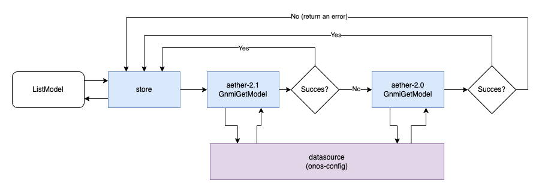

# Architecture and implementation

The source of truth for the exposed API is `protobuf`.
You can find the current version of the exposed models in the [api](../api) directory.

## Code generation toolchain

The main tool we are using to drive the code generation is [`buf`](https://docs.buf.build/introduction)
and it relies on `protoc` and `protoc plugins`. You can find the full list of plugins
that we are using in [buf.gen.yaml](../buf.gen.yaml).

On top of that we are using [`gqlgen`](https://gqlgen.com/) to generate the `GraphQL`
server (using the generated `go` bindings and `graphql` schemas).

All the generated code ends up in the [gen](../gen) package.

### Southbound Interfaces

At the moment we are using the autogenerated client interface for the Aether models
in `onos-config` that is available through `aether-roc-api`. This might change in the
future as we might move that code generation inside the `aether-models` repository.

## Internals

The code is organized with extensibility in mind, and we are putting a great deal of 
effort in keeping different component isolated. The main reason for that is scalability:
it might come a day in which we have enough requests on a particular resource that it makes
sense to separate it in a different microservice.

Currently the code is organized as:
- `datasources`: contains the required code to interact with the southbound services, 
the source of the data.
- `servers`: contains wrappers to create the `grpc` and `rest` servers
- `stores`: contains 
  - the logic to aggregate the data from different `datasources` and makes
  them available to the `grpc` server
  - the `grpc` service implementation
  - the `rest` and `graphql` bindings to the `grpc` server

A simpler way to understand the internal implementation is to look at how a request is handled.
We'll be using the `Aether Enterprise` model as an example:

### Support for multiple internal API versions 

> This not implemented/supported at the moment. Treat as a Design proposal.

The store is where the abstraction between the northbound APIs and the internal API
is implemented. In the future it will support multiple version of the southbound APIs,
so that a request can be satisfied both via the `aether-2.0` and the `aether-2.1` models.

A possible implementation is detailed in the following diagram:

Translating the diagram in words a request lifecycle would be:
- A request to `list` a model is received in the `store`
- The `store` tries to fetch the data using the latest API
  - If the request succeeds we return the data
- If the request fails we try to use an older version of the API
  - If the request succeeds we return the data
  - If the request fails we return the error

When you consider that the `onos-config` endpoint is a Kubernetes service it's easy to
envision how this implementation opens to way to blue/green migration: 
we can have two different `onos-config` instances, one implementing the `aether-2.0` models
and one implementing the `aether-2.1` models, being associated with the same `onos-config` service.

By its own nature the kubernetes service will round-robin requests between the two,
and that is perfectly fine as the `store` is capable to handle different API versions.

Once we are confident that the new instance is working fine, we can shut down the old one,
effectively having upgraded the backend service without disrupting the clients.

> NOTE it might be a little more complex than this and require two different endpoints to be
> configure, one as main and one as backup, so that we know which API we are calling. 
> Definitely requires more discussions/design.